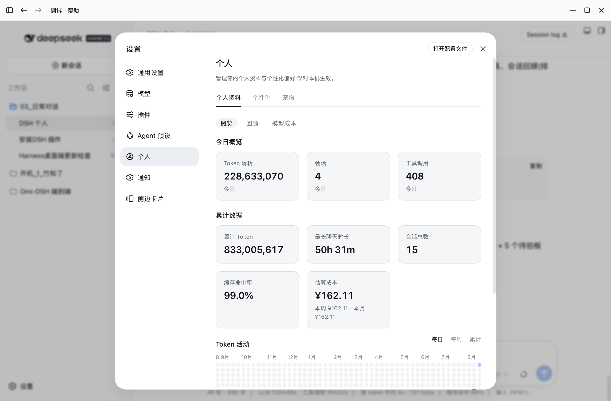
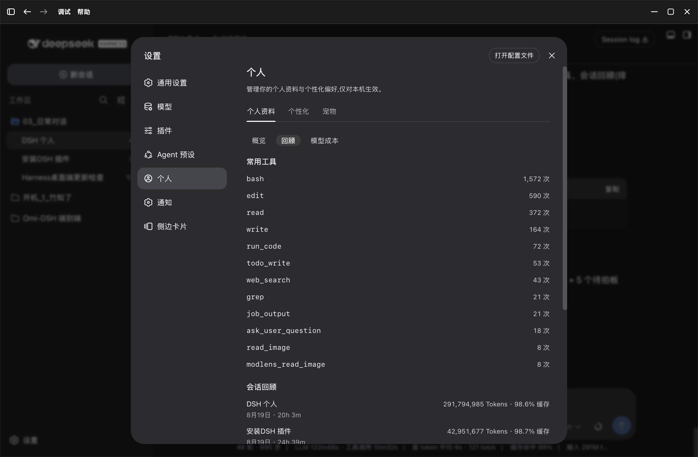
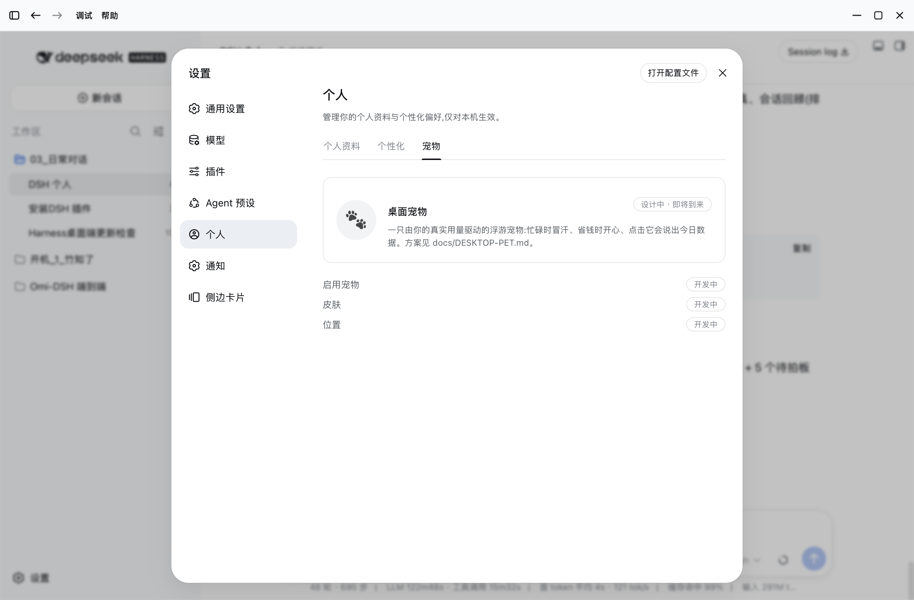
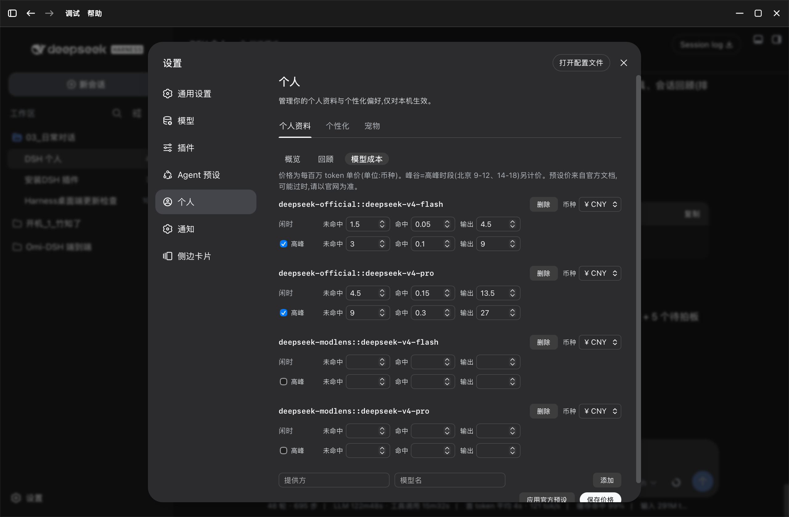

# DSH 个人中心 (dsh-personal-center)

> DeepSeek Harness 的个人中心插件:设置 → **「个人」分区**,提供 **个人资料统计 / 个性化自定义指令 / 成本估算**。

一个面向 DeepSeek Harness(DSH)桌面端 / Web 端的本地插件。在设置里新增「**个人**」分区,含三个外层 tab:

- **个人资料**:真实用量统计 —— 今日/累计 Token、会话数、工具调用、Token 活动热力图(每日·每周·累计)、按模型分布、常用工具、会话回顾;
- **个性化**:全局自定义指令(等价于 ChatGPT / Codex 桌面端的「个性化 → 自定义指令」),对本机所有聊天生效;
- **模型成本**:按模型估算成本(支持峰谷分时、分币种、官方预设价),外加**缓存命中率**统计。

纯本地运行,不联网、不读取聊天正文,详见 [PRIVACY.md](PRIVACY.md)。

## 📸 截图

| 浅色 · 个人资料 | 深色 · 回顾 |
|---|---|
|  |  |

| 浅色 · 宠物 | 深色 · 模型成本 |
|---|---|
|  |  |

## ✨ 功能

### 个人资料(统计)

- **今日概览**:Token 消耗 / 会话 / 工具调用;
- **累计数据**:累计 Token / 最长聊天时长 / 会话总数 / **缓存命中率** / **估算成本**;
- **Token 活动**:GitHub 贡献图风格热力图,支持 **每日 / 每周 / 累计** 三态切换;
- **按模型分布**:按 provider + model 拆分 Token、请求数、**每模型缓存命中率**与成本(多模型对比一目了然);
- **常用工具**:按调用次数排序(含 `mcp__<server>__<tool>` 形式的 MCP 工具);
- **会话回顾**:最近会话列表(标题 / 日期 / 时长 / Token / 缓存命中率),**自动排除已归档会话**。

数据来源:扫描本机会话日志实时聚合,只读数字、不读正文。见 [docs/DESIGN.md](docs/DESIGN.md)。

### 模型成本(估算)

- 按模型 × 每百万 token 单价估算成本,**分币种**(¥/$)分别合计;
- 支持 **峰谷分时**(DeepSeek 官方口径:北京 9:00-12:00、14:00-18:00 为高峰,空闲=高峰一半);
- 内置官方预设价(deepseek / kimi / gemini / gpt),提供「提供方→模型」联想添加,可自改;
- 展示:**本周 / 本月 / 累计** 成本。

### 个性化(全局自定义指令)

- 输入身份 / 工作原则 / 回答偏好,点击**保存**;
- 保存后,**本机所有会话(含已存在的)的下一次请求立即带上这段指令**;
- 支持清空;清空后指令从系统提示词中消失,不占 token;
- 中英文双语,样式复用 DSH 设计令牌,与原生设置一致。

## 🛠 安装

### 方式一:插件控制台 / CLI(推荐)

```sh
dsh plugin --profile web add github:PolinniZhong/dsh-personal-center
```

或打开 Web GUI → 设置 → 插件 → 插件控制台,搜索「个人中心」安装。

### 方式二:本地开发(link 依赖,和 dsh-omi-voice 同款)

1. 克隆本仓库到本地任意目录;
2. 在 profile 的 `package.json` 中加入依赖:

   ```json
   "dsh-personal-center": "link:/绝对路径/DSH 个人中心"
   ```

3. 在 profile 的 `dsh.profile.bundles` 列表中加入 `"dsh-personal-center"`;
4. 重启 DSH 应用。

> 注:重启后,若 `node_modules` 中没有该包,可手动建立软链接:
> `ln -s /绝对路径/DSH 个人中心 <DSH_HOME>/profiles/web/node_modules/dsh-personal-center`

### 卸载

设置 → 插件 → 插件控制台,停用 / 删除 `dsh-personal-center`;或删除 `package.json` 中的依赖与 `bundles` 条目。

## 🗺 路线图

| 版本 | 内容 | 状态 |
|---|---|---|
| v0.1 | 个性化 → 自定义指令(全局注入) | ✅ 可用 |
| v0.2 | 「个人」分区:统计(真实数据)+ 个性化 | ✅ 可用 |
| v0.3 | 成本估算(峰谷分时/分币种/官方预设)、缓存命中率、会话回顾(排除归档) | ✅ 可用 |
| v0.4 | 桌面宠物(小黑鲸,数据驱动情绪) | 🚧 规划中 |
| v0.5 | 用量导出(JSON/CSV)、月度/年度对比 | 💡 构想 |

## 🤔 为什么做这个(立项评审摘要)

1. **技术可行**:DSH 是插件化架构(宿主插件 + 浏览器 bundle),本仓库即是范例;会话日志记录了每次请求的 token 用量与工具调用事件,MCP 工具以 `mcp__<server>__<tool>` 命名可直接归类;
2. **符合用户心理**:量化反馈(类似 GitHub 贡献图)、成本透明(按 token 计费)、差异化(官方暂无个人中心/全局统计)、隐私友好(只聚合数字);
3. **风险与对策**:安装门槛 → 一键安装;数据准确性 → 直接读权威日志;性能 → 宿主端聚合 + 60s 缓存。

## 📁 仓库结构

```
├── package.json          # dsh.bundle.patch + dsh.client 声明
├── cordis.patch.yml      # 插入插件行
├── lib/
│   ├── index.js          # 宿主:设置命名空间 + 系统提示词注入 + 统计服务 + 环回路由
│   └── client.js         # 浏览器:「个人」分区 UI(统计 + 个性化)
├── docs/
│   ├── README.md         # 项目知识地图(入口)
│   ├── DESIGN.md         # 架构与设计决策
│   ├── PLAN.md           # 实施规划与路线图
│   ├── PLATFORM-NOTES.md # DSH 平台要点与坑
│   ├── DESIGN-SYSTEM.md  # 设计规范(间距/字号/色值)
│   ├── DATA-MODEL.md     # 会话日志数据模型
│   └── nav-icon-patch.md # 个人导航图标补丁说明
├── docs/screenshots/     # 截图
├── PRIVACY.md            # 隐私说明
├── README.md
└── LICENSE               # MIT
```

> 想了解架构/踩坑/规范,从 [docs/README.md](docs/README.md) 的知识地图开始。

## 📄 许可

[MIT](LICENSE)

## 🙏 致谢

架构参考 [dsh-omi-voice](https://github.com/)(link 依赖 + bundle patch 模式)与 [dsh-plugin-hub](https://github.com/Noob-stupid/dsh-plugin-hub)(插件控制台安装通道)。
